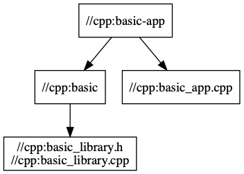
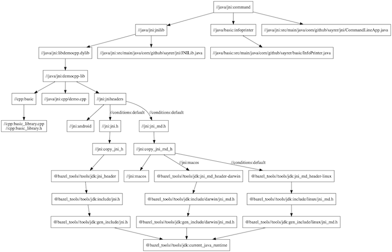

# Bazel Lesson 1

This is a conversational introduction to Bazel. The first lesson will introduce basic Bazel concepts, and teach you how to build simple command line apps in Java and C++. It's recommended that you clone this repo and follow along in the terminal.

This text assumes you're running macOS 10.14, but it shouldn't be difficult to adapt the instructions for other operating systems. To get started, install [Bazel](https://docs.bazel.build/versions/master/install.html) and [Homebrew](https://brew.sh/), and make sure you have XCode installed.

```
$ bazel version
Build label: 0.24.1
Build target: bazel-out/darwin-opt/bin/src/main/java/com/google/devtools/build/lib/bazel/BazelServer_deploy.jar
Build time: Tue Apr 2 16:32:47 2019 (1554222767)
Build timestamp: 1554222767
Build timestamp as int: 1554222767

$ brew --version
Homebrew 2.1.1
Homebrew/homebrew-core (git revision 11fb; last commit 2019-04-16)
Homebrew/homebrew-cask (git revision 340e6; last commit 2019-04-16)
```

Install graphviz, which we'll use to visualize our build.

```
$ brew install graphviz
... (this will build a lot of stuff) ...
$ dot -V
dot - graphviz version 2.40.1 (20161225.0304)
```

# A simple C++ command line app

At the root of this repository, you'll see a file in all-caps called WORKSPACE. We won't get into its contents, but its purpose is to describe dependencies, both for our applications and extensions to Bazel itself.

The first thing we'll build is a trivial C++ command line application, with an associated library and a test. Bazel distributes what it calls "targets" throughout the project's directories. You specify targets using a path syntax, where "//" identifies the top-level directory that contains WORKSPACE. If you look in `cpp/BUILD`, you'll find three targets.

```
$ more cpp/BUILD 
cc_binary(
    name = "basic-app",
    srcs = ["basic_app.cpp"],
    deps = [
        "basic",
    ]
)

cc_library(
    name = "basic",
    srcs = ["basic_library.cpp"],
    hdrs = ["basic_library.h"],
    visibility = ["//visibility:public"],
)

cc_test(
    name = "basic-test",
    srcs = ["basic_library_test.cpp"],
    copts = ["-Iexternal/gtest/include"],
    deps = [
        "@gtest//:main",
        "basic",
    ],
)
```

The cc_binary target called "basic-app" is a command line binary you can run:

```
$ bazel run //cpp:basic-app
INFO: Analysed target //cpp:basic-app (14 packages loaded, 128 targets configured).
INFO: Found 1 target...
Target //cpp:basic-app up-to-date:
  bazel-bin/cpp/basic-app
INFO: Elapsed time: 2.688s, Critical Path: 0.62s
INFO: 4 processes: 4 darwin-sandbox.
INFO: Build completed successfully, 7 total actions
INFO: Build completed successfully, 7 total actions

I'm a C++ string!

```

What this does is create the binary, copy it into a working directory, and then run it. This ends up being really handy for packaging, because you can specify data files as dependencies and have them copied to the right place, without worrying about doing this yourself. Let's take a look at the dependencies of this tiny app with Bazel's query language.

```
$ bazel query "deps(//cpp:basic-app)"
//cpp:basic-app
//cpp:basic_app.cpp
//cpp:basic
@bazel_tools//tools/def_parser:def_parser
@bazel_tools//tools/def_parser:no_op.bat
@bazel_tools//tools/def_parser:def_parser_windows
@bazel_tools//tools/def_parser:def_parser.exe
@bazel_tools//third_party/def_parser:def_parser
@bazel_tools//tools/cpp:malloc
@bazel_tools//third_party/def_parser:def_parser_main.cc
@bazel_tools//third_party/def_parser:def_parser_lib
@bazel_tools//third_party/def_parser:def_parser.h
@bazel_tools//third_party/def_parser:def_parser.cc
@bazel_tools//src/conditions:remote
@bazel_tools//src/conditions:host_windows
@bazel_tools//tools/cpp:toolchain
//external:cc_toolchain
@local_config_cc//:toolchain
...
@local_config_cc//:libtool
@local_config_cc//:cc_wrapper
@local_config_cc//:cc_wrapper.sh
@local_config_cc//:empty
@bazel_tools//tools/objc:host_xcodes
@bazel_tools//tools/cpp:link_dynamic_library
@bazel_tools//tools/cpp:link_dynamic_library.sh
@bazel_tools//tools/cpp:interface_library_builder
@bazel_tools//tools/cpp:build_interface_so
@bazel_tools//tools/cpp:grep-includes
@bazel_tools//tools/cpp:grep-includes.sh
//cpp:basic_library.h
//cpp:basic_library.cpp
Loading: 2 packages loaded
```

This shows that our app depends on the files in our library, and the local C/C++ compiler (XCode). You can specify a specific compiler and toolchain in WORKSPACE for better reproducibility. If we add a few flags, we can narrow down the returned values to just our code.

```
$ bazel query  --nohost_deps --noimplicit_deps "deps(//cpp:basic-app)"
//cpp:basic-app
//cpp:basic_app.cpp
//cpp:basic
//cpp:basic_library.h
//cpp:basic_library.cpp
```

And, we can visualize it using graphviz:

`$ bazel query  --nohost_deps --noimplicit_deps "deps(//cpp:basic-app)" --output=graph | dot -Tpng | open -f -a /Applications/Preview.app`




If you take a look at Bazel's output, you can see what's been built:

```
$ ls -l bazel-out/darwin-fastbuild/bin/cpp/
total 64
drwxr-xr-x  4 sayrer  wheel    128 Apr 23 10:14 _objs
-r-xr-xr-x  1 sayrer  wheel  23716 Apr 23 10:14 basic-app
drwxr-xr-x  4 sayrer  wheel    128 Apr 23 10:14 basic-app.runfiles
-r-xr-xr-x  1 sayrer  wheel    150 Apr 23 10:14 basic-app.runfiles_manifest
-r-xr-xr-x  1 sayrer  wheel   3008 Apr 23 10:14 libbasic.a
```

Next, we'll run our C++ test. The "..." at the end of the path tells bazel to run every test target under the //cpp/ path.

```
$ bazel test //cpp/...

INFO: Elapsed time: 3.080s, Critical Path: 2.83s
INFO: 14 processes: 14 darwin-sandbox.
INFO: Build completed successfully, 18 total actions
//cpp:basic-test                                                         PASSED in 0.1s

Executed 1 out of 1 test: 1 test passes.
INFO: Build completed successfully, 18 total actions
```

If you run it again, you'll note that it says "(cached)", meaning Bazel determined that the test needn't be rerun, as none of its dependencies had changed. If you edit one of the basic_library files, or the test file itself, Bazel will rerun the test. If you change basic_app.cpp (the file with the main function), it won't, because the test doesn't depend on the binary, only the library. Take another look at `cpp/BUILD` with this dependency graph in mind.

This caching feature applies to tests and builds, it will work in the presence of huge dependency graphs, and can be pushed very far with a caching build server. In companies where this is working really well, most files are already built for you, because someone has already done a build with a matching toolchain.

# Java

The setup for Java is pretty similar, except that the convention is to follow Maven's directory structure. 

```
$ bazel run //java/basic:command
INFO: Analysed target //java/basic:command (21 packages loaded, 483 targets configured).
INFO: Found 1 target...
Target //java/basic:command up-to-date:
  bazel-bin/java/basic/command.jar
  bazel-bin/java/basic/command
INFO: Elapsed time: 9.680s, Critical Path: 5.86s
INFO: 5 processes: 3 darwin-sandbox, 2 worker.
INFO: Build completed successfully, 9 total actions
INFO: Build completed successfully, 9 total actions

Hi from Java!

```

Running the tests is a similar experience as well:

```
$ bazel test //java/...
INFO: Analysed 3 targets (1 packages loaded, 6 targets configured).
INFO: Found 2 targets and 1 test target...
INFO: Elapsed time: 0.697s, Critical Path: 0.55s
INFO: 1 process: 1 darwin-sandbox.
INFO: Build completed successfully, 3 total actions
//java/basic:test                                                        PASSED in 0.5s

Executed 1 out of 1 test: 1 test passes.
INFO: Build completed successfully, 3 total actions


sayrer:crossplatform sayrer$ bazel test //java/...
INFO: Analysed 3 targets (1 packages loaded, 6 targets configured).
INFO: Found 2 targets and 1 test target...
INFO: Elapsed time: 0.156s, Critical Path: 0.01s
INFO: 0 processes.
INFO: Build completed successfully, 1 total action
//java/basic:test                                               (cached) PASSED in 0.5s

Executed 0 out of 1 test: 1 test passes.
INFO: Build completed successfully, 1 total action
```

# Combining C++ and Java

To wrap up this lesson, we'll combine our C++ and Java libraries in one executable using JNI.

```
$ bazel run -s //java/jni:command
INFO: Analysed target //java/jni:command (0 packages loaded, 0 targets configured).
INFO: Found 1 target...
Target //java/jni:command up-to-date:
  bazel-bin/java/jni/command.jar
  bazel-bin/java/jni/command
INFO: Elapsed time: 0.127s, Critical Path: 0.00s
INFO: 0 processes.
INFO: Build completed successfully, 1 total action
INFO: Build completed successfully, 1 total action

Hi from Java!


I'm a C++ string!

```

Here, you can see our Java binary running the Java and C++ libraries we just built. To get a look at the dependency graph, run this command:

`bazel query  --nohost_deps --noimplicit_deps "deps(//java/jni:command)" --output=graph | dot -Tpng | open -f -a /Applications/Preview.app`

If you go back and edit `cpp/basic_library.cpp`, you'll find that this project gets rebuilt as well.



This dependency graph is starting to get large, but it's really not much compared to a production Bazel project.

# Wrapping up

Lesson 1 should have explained the basic concepts behind Bazel, and shown why it is such a powerful system for building production software in multiple projects across a single company or organization. The next lesson will build on this basic skeleton to produce mobile clients, servers, and wire traffic they can use to communicate.
